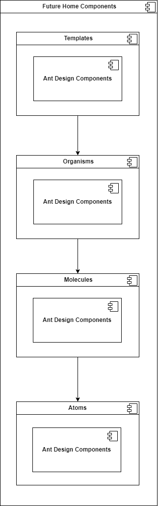

# Architecture Design Record: 99x Design System

## Overview

The 99x Design System is a comprehensive UI component library and design system built using React and Vite, with Storybook integration for isolated component development. This architecture design record outlines the structure, methodologies, and tools employed to ensure the system's scalability, consistency, and efficiency.

## Key Components

1. **React:** A JavaScript library for building user interfaces, enabling component-based architecture.
2. **Vite:** A fast build tool and development server for modern web projects.
3. **Storybook:** A tool for developing UI components in isolation, facilitating visualization, testing, and documentation.
4. **Atomic Design:** A methodology for creating scalable and reusable design systems by organizing UI components into five hierarchical levels: Atoms, Molecules, Organisms, Templates, and Pages.
5. **Ant Design:** A popular React UI library that provides pre-built components, wrapped and customized within the 99x Design System.

## Architectural Principles

1. **Modularity:** Each component is developed as an independent module, allowing for easy maintenance, testing, and reuse.
2. **Scalability:** The design system is built to scale, accommodating new components and features without disrupting existing structures.
3. **Consistency:** Atomic Design principles ensure uniformity in design elements, maintaining a consistent look and feel across the application.
4. **Performance Optimization:** Techniques such as selective imports, tree shaking, and dynamic imports are employed to reduce bundle size and improve performance.
5. **Collaboration:** Clear component definitions and documentation streamline collaboration between designers and developers, enhancing productivity.

## Component Hierarchy

<div style="text-align: center;">
  
</div>

### Atomic Design Levels

1. **Atoms:** Basic building blocks that cannot be further subdivided (e.g., buttons, labels, icons).
2. **Molecules:** Combinations of atoms that function together as a unit (e.g., form fields with labels and buttons).
3. **Organisms:** Complex components composed of multiple molecules (e.g., navigation bars, media boxes).
4. **Templates:** Page-level structures that define the layout and placement of organisms (e.g., homepage, dashboard templates).
5. **Pages:** Specific instances of templates, representing actual pages within the application (e.g., user profile page, product detail page).

## Tools and Technologies

### Development Tools

- **React:** Enables the creation of reusable UI components.
- **Vite:** Provides a fast and efficient development environment with hot module replacement.
- **Storybook:** Facilitates the development and testing of UI components in isolation.

### Performance Optimization

1. **Selective Imports:**
    - Import only the necessary components and styles from Ant Design.
    ```js
    import Button from "antd/es/button";
    import "antd/es/button/style/css";
    ```

2. **Tree Shaking:**
    - Eliminate unused code during the build process to reduce bundle size.
    ```js
    // webpack.config.js
    const path = require("path");

    module.exports = {
      entry: "./src/index.js",
      output: {
        filename: "bundle.js",
        path: path.resolve(__dirname, "dist"),
      },
      mode: "development",
      optimization: {
        usedExports: true,
      },
    };
    ```

3. **Dynamic Imports:**
    - Load components asynchronously to optimize initial load times.
    ```js
    import React, { useState, useEffect } from "react";

    const DynamicModal = React.lazy(() => import("antd/es/modal"));

    function Modal() {
      const [showModal, setShowModal] = useState(false);

      useEffect(() => {
        const timer = setTimeout(() => {
          setShowModal(true);
        }, 2000);

        return () => clearTimeout(timer);
      }, []);

      return (
        <div>
          <h1>Welcome to My Component!</h1>
          <React.Suspense fallback={<div>Loading...</div>}>
            {showModal && (
              <DynamicModal visible={true}>
                <p>This is the content of the modal.</p>
              </DynamicModal>
            )}
          </React.Suspense>
        </div>
      );
    }

    export default Modal;
    ```

## Benefits

### Efficiency

- **Isolated Development:** Storybook allows developers to focus on individual component variations without running the entire application.
- **Automated Testing:** Stories in Storybook can be used for automated accessibility, interaction, and visual testing.

### Consistency

- **Atomic Design Principles:** Ensure uniformity in design elements, maintaining a consistent look and feel across the application.
- **Component Reusability:** Modular design promotes reuse, reducing redundancy and enhancing maintainability.

### Scalability

- **Flexible Structure:** The hierarchical organization of components allows for seamless integration of new features.
- **Independent Components:** Modular components facilitate easy updates and modifications without affecting other parts of the system.

### Collaboration

- **Clear Documentation:** Storybook auto-generates documentation, making it easy for team members to understand and utilize existing components.
- **Defined Component Hierarchy:** Streamlines collaboration between designers and developers, enhancing productivity and efficiency.