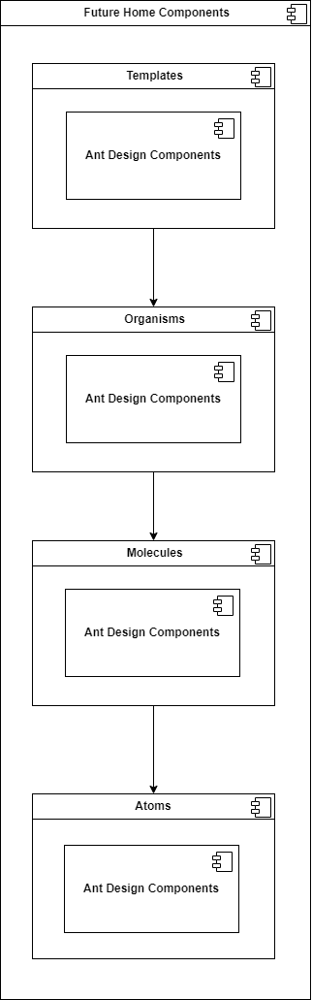

# 99x Design System Storybook Template

Storybook offers a comprehensive environment for developing UIs in isolation. It enables the creation and testing of hard-to-reach states and edge cases without the need to run the entire application. By providing an isolated iframe to render components, Storybook ensures that development can focus on each component variation without interference from app business logic and context.

### Benefits of Using Storybook

1. **Build UIs in Isolation:** Storybook allows visualization of components independently, without the need to spin up the entire application. This enables rendering specific variations by passing props, mocking data, or faking events.

2. **Capture UI Variations as Stories:** Each story in Storybook demonstrates a specific variation of a component to verify appearance and behavior. These stories facilitate granular UI component development, testing, and documentation.

3. **Track Every Story:** Storybook acts as an interactive directory of UI components and their stories. It enables developers to jump directly to a specific UI component state.

4. **Develop Durable UIs:** Storybook helps verify hard-to-reach edge cases in UI development. Addons can mock everything from context and API requests to device features.

5. **Effortless and Reliable UI Testing:** Stories can automate accessibility, interaction, and visual testing. They can also serve as test cases for other JavaScript testing tools.

6. **Team Collaboration and Reuse:** Storybook serves as the single source of truth for the UI, indexing all components and their various states. This makes it easy for the team to find and reuse existing UI patterns. Storybook also auto-generates documentation from these stories.

7. **Integration with CI Workflows:** Storybook is compatible with continuous integration workflows and can be added as a CI step to automate user interface testing.

## Reusable Component Hierarchy

<div style="text-align: center;">
  
</div>

In our development process, we embrace the Atomic Design methodology, coupled with Ant Design components, to construct a robust design system for our Micro Frontends. Ant Design components are wrapped using our own components and utilized by other Micro Frontends. Atomic Design, pioneered by Brad Frost, organizes UI components into five hierarchical levels, fostering reusability and scalability.

### Benefits of Using Atomic Design

1. **Promotes Reusability and Consistency:** Atomic Design decomposes interfaces into reusable components such as buttons, text fields, and icons. This ensures uniformity in style, color, and layout across the system.

2. **Facilitates Collaboration:** Clearly defined components streamline collaboration among designers and developers, enhancing productivity and efficiency by enabling concurrent work on different components.

3. **Simplifies Testing:** Isolated testing of atomic components expedites bug detection and resolution. Testing individual components allows for swift issue localization and rectification, improving overall system reliability.

4. **Allows for Scalability:** Atomic components, as independent building blocks, enable seamless integration of new components without disrupting existing ones. This scalability ensures the design system evolves without compromising stability.

### Elements of Atomic Design

1. **Atoms:** The foundational elements that cannot be further subdivided without losing functionality. Examples include buttons, labels, and icons.

2. **Molecules:** Groups of atoms that function independently as a unit. For example, a signup form molecule combines input fields, buttons, and labels. Molecules demonstrate how atoms interact and combine into usable microcomponents.

3. **Organisms:** Complex UI components composed of multiple molecules. Organisms represent more intricate sections of an interface, such as signup forms and media boxes.

4. **Templates:** Define the basic structure of a page, ensuring consistency across the website or application. Examples include homepage and profile page templates.

5. **Pages:** Specific instances of templates, such as a homepage or product page, that exist within the Micro Frontend.

By adhering to Atomic Design principles and leveraging Ant Design components, we create a flexible, scalable design system that empowers Micro Frontend development while maintaining consistency and efficiency across our ecosystem.

## Reducing the Bundle Size of Ant Design

1. **Selective Import of Components:** Import specific components needed in the bundle to reduce size and improve performance.

    ```js
    import Button from "antd/es/button";
    ```

2. **Selective Import of Component Styles:** Import styles for individual Ant Design components only when they are used in the project to reduce the CSS bundle size.

    ```js
    import "antd/es/button/style/css";
    ```

3. **Tree Shaking:** Tree shaking eliminates dead code. Ant Design is adapted for tree shaking, removing unused components during compilation.

    ```js
    // webpack.config.js
    const path = require("path");

    module.exports = {
      entry: "./src/index.js",
      output: {
        filename: "bundle.js",
        path: path.resolve(__dirname, "dist"),
      },
      mode: "development",
      optimization: {
        usedExports: true,
      },
    };
    ```

4. **Dynamic Imports:** Use dynamic imports for non-essential components to load them asynchronously during runtime, optimizing initial page load times and contributing to a leaner bundle size.

    ```js
    import React, { useState, useEffect } from "react";

    const DynamicModal = React.lazy(() => import("antd/es/modal"));

    function Modal() {
      const [showModal, setShowModal] = useState(false);

      useEffect(() => {
        const timer = setTimeout(() => {
          setShowModal(true);
        }, 2000);

        return () => clearTimeout(timer);
      }, []);

      return (
        <div>
          <h1>Welcome to My Component!</h1>
          <React.Suspense fallback={<div>Loading...</div>}>
            {showModal && (
              <DynamicModal visible={true}>
                <p>This is the content of the modal.</p>
              </DynamicModal>
            )}
          </React.Suspense>
        </div>
      );
    }

    export default Modal;
    ```

By integrating Storybook and adopting Atomic Design principles, the 99x Design System ensures efficient, scalable, and consistent UI development. Through selective imports, tree shaking, and dynamic imports, we optimize performance and maintain a lean bundle size, enhancing the overall user experience.