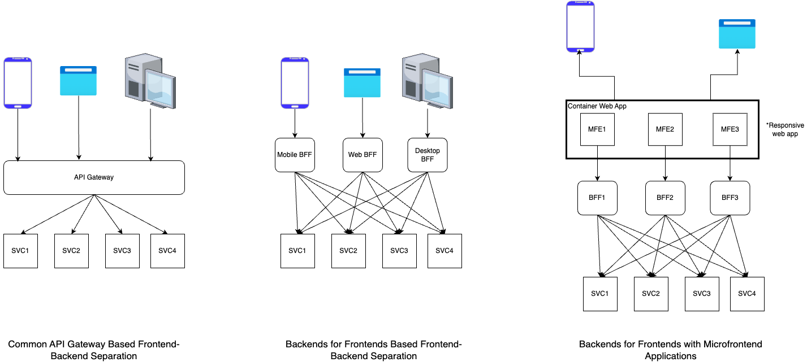
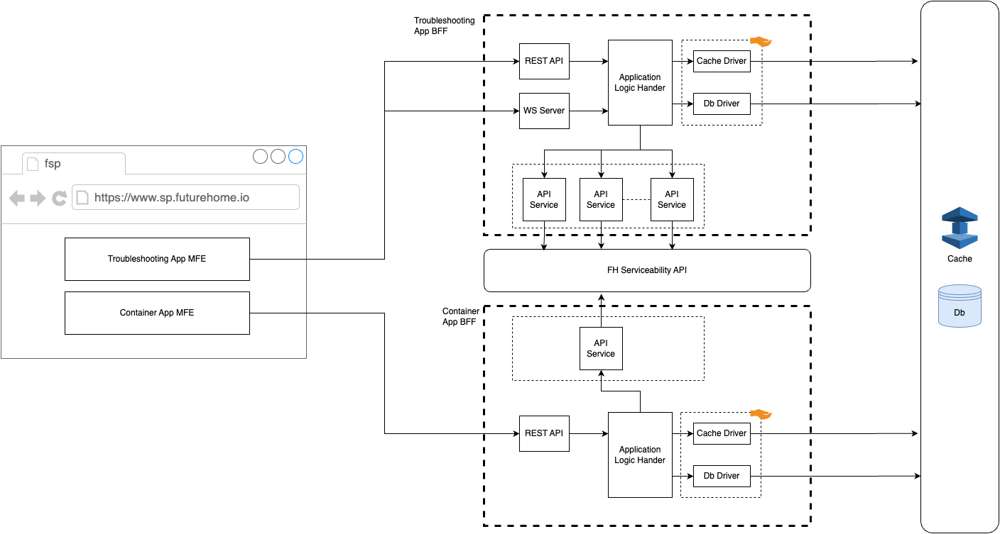

## BFF Architecture
### The BFF pattern
The importance of dedicated backends for specific front ends arose when different front-ends started demanding specific backend behavior mainly based on the client platform they were running.

For the implementation of FSP, we have chosen to go with dedicated BFFs for separate MFEs to make it easier for the development teams to work independently. However, as we are utilizing the monorepo pattern, we will still be able to share code and components between different MFEs and BFFs without adding an additional complexity to the development process.

 
Above diagram illustrates the BFF architecture for FSP solution captured into the scope.

Here, it allows the BFF to manage sensitive data like access tokens, API keys, connections strings securely in the backend without relying on the frontend.

BFFs will be separated based on the MFE but will share common components as indicated in the diagram above.

For an example, the database handler and cache handler can be shared by all the BFFs in the application.

Simiraly, the Core API wrappers are logically separated for the added flexibility for the future. If these services needs to be shared across many BFFs in the future, they will be moved to a common library and referred by the BFFs as needed.

That level of separation is not brought into the design as of now to keep the initial complexity of the system low. 
