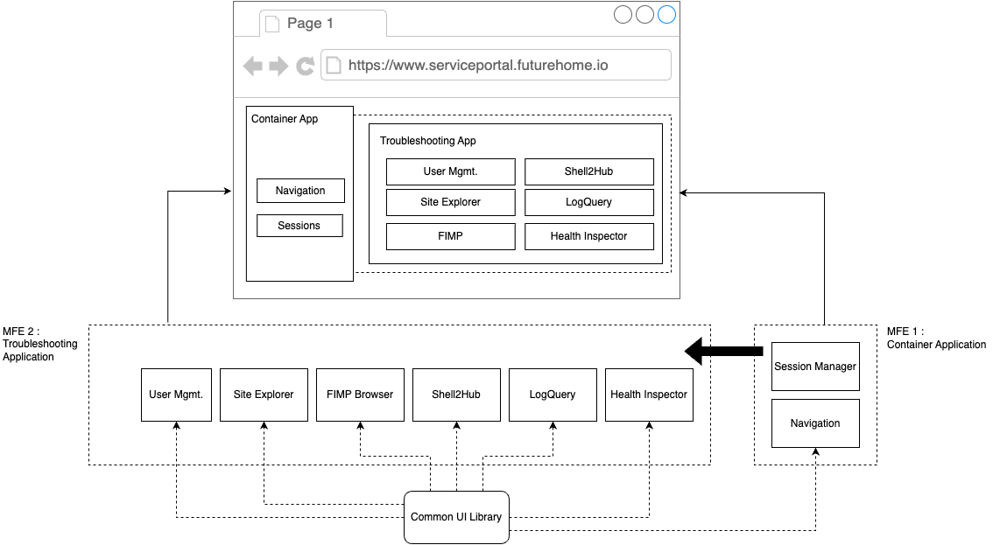

## Front End Architecture

### Use of common libraries
One of the key concepts behind the new architecture is that the frontend contains a common UI library which is used across all the MFEs implemented inside the FSP. 

### Use of shared MFEs
The MFE1, which is the container application is injected to functional MFEs (In this case the MFE2) so that the team who is developing a specific MFE can developer, test launch, debug and deploy their application without depending on other  application engineering teams.