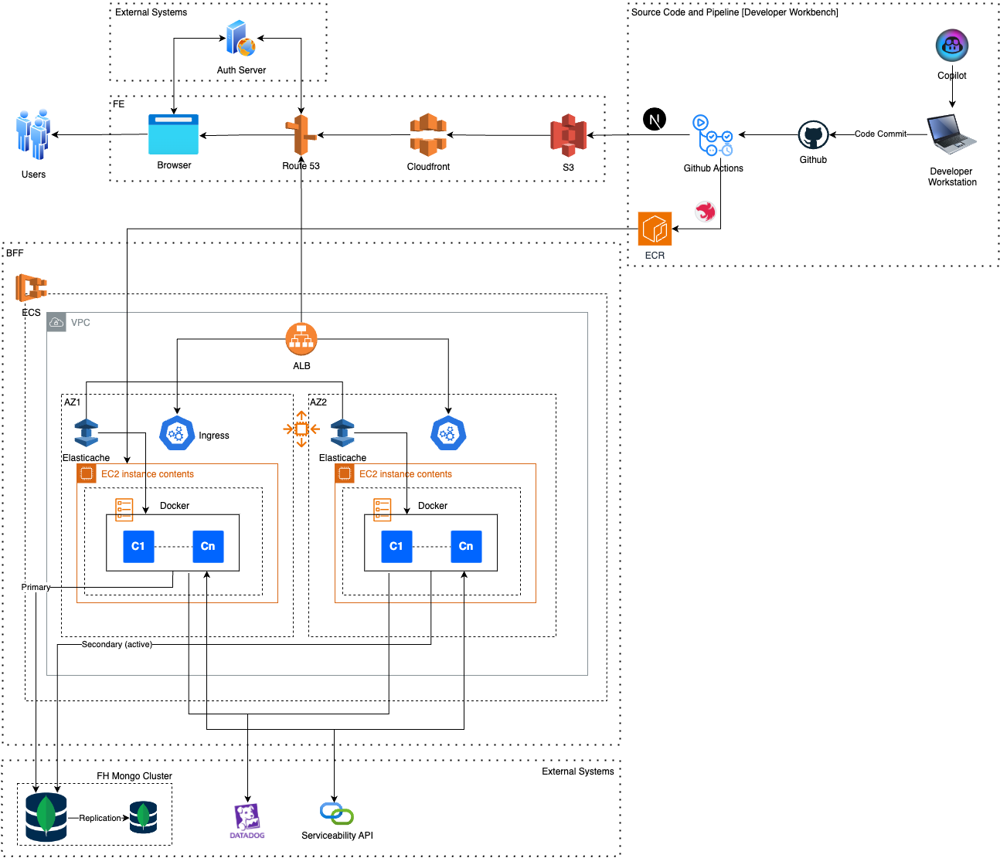

# Product Architecture for AWS Fullstack Application

## Introduction

This document summarizes the product architecture proposed for the AWS Fullstack Application's (will be referred as **FSP** in short form) which consists of a front end SPA (with micro front end capabilities) and corresponding backends for the front-ends.

## Application Architecture
The application consist of 6 functional components.

1. User Administration
1. Site Explorer with search
1. FIMP Message Browser with command execution
1. SSH to SmartHub
1. Log Query App
1. Automated Health Diagnostics

These six components are aggregated into one frontend (MFE2) named **troubleshooting application**.

In addition to the troubleshooting application, following two functional components will be grouped under another frontend (MFE1) called the **container or shell application**.

1. Session Manager
1. Navigation with auth functions

The client (FrontEnd) application (MFE1 + MFE2) of FSP is a static webapp which is deployed in a S3 behind a CDN. The backend application (BFF) is deployed to ECS via github actions and ECR.

This application is designed based on the assumption that the core business features are served by the serviceability API which is provided by the AWS Fullstack Application.

The FSP mainly takes care of activities related to user flow (a.k.a. user actions). This means that while the Serviceability API handling all the core business features, user experience related functionalities will be taken cared by the FSP presented here.

The proposed architecture uses ECS cluster deployed in two availability zones. To comply with the current technology mixture of the organization, we have used existing MongoDb managed services cluster used by AWS Fullstack Application which assures high availability and active fault tolerance.

The ALB support both WS and HTTP protocols which access the ECS ingress within the auto scaling environment. 

The BFF service layer directly consumes the CoreAPI (WS/HTTP only) hiding additional communication modes behind the API 
(e.g. FIMP).

The preferred application logs and telemetry platform is Datadog. 
