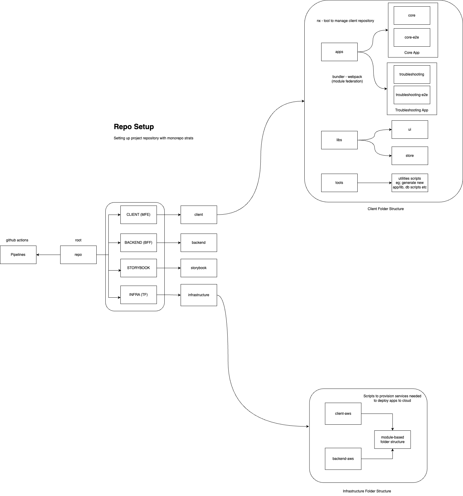

## Organization of the source repository

We've established a clear separation of concerns within our codebase for better maintainability and scalability. This section outlines the structure for the client-side code and infrastructure, with placeholders for backend and storybook integration to be defined later.

