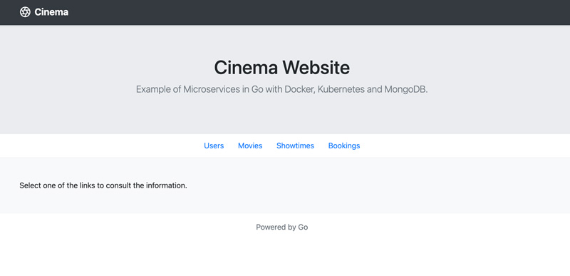

# Cinema - Microservices in Go with Docker, Kubernetes and MongoDB

## Overview

Cinema is an example project which demonstrates the use of microservices for a fictional movie theater.
The Cinema backend is powered by 4 microservices, all of which happen to be written in Go, using MongoDB for manage the database and Docker to isolate and deploy the ecosystem.

 * Movie Service: Provides information like movie ratings, title, etc.
 * Show Times Service: Provides show times information.
 * ${{values.firstAppName}} Service: Provides ${{values.firstAppName}} information.
 * Users Service: Provides movie suggestions for users by communicating with other services.

Container images used support multi-architectures (amd64, arm/v7 and arm64).

## Index

* [Deployment](#deployment)
* [How To Use Cinema Services](#how-to-use-cinema-services)
* [Related Posts](related-posts)
* [Significant Revisions](#significant-revisions)
* [The big picture](#screenshots)

## Deployment

The application can be deployed in both environments: **local machine** or in a **kubernetes cluster**. You can find the appropriate documentation for each case in the following links:

* [local machine (docker compose)](./docs/localhost.md)
* [kubernetes (helm)](./docs/kubernetes-helm.md)

## How To Use Cinema Services

* [endpoints](./docs/endpoints.md)

## Screenshots

### Architecture

### Homepage

### Users List

