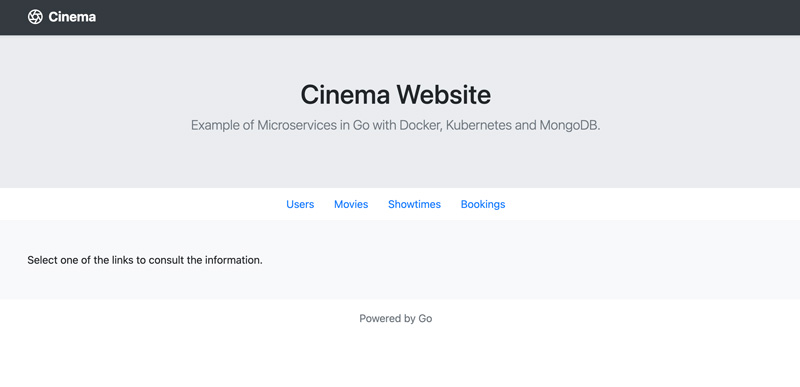
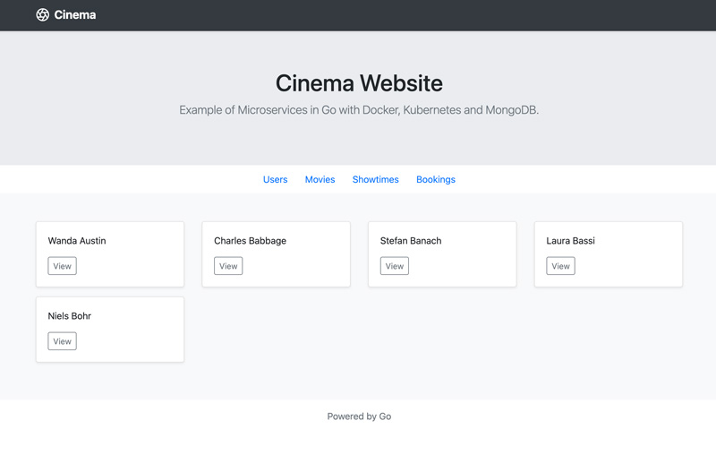
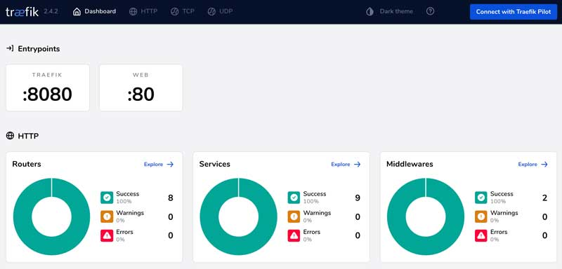

# Cinema - Localhost Deployment

## Overview

The Cinema project can be deployed in a single machine (localhost) using Docker Compose V2.

> Access to [compose-v1](https://github.com/99x-product-central-dev/microservices-docker-go-mongodb/tree/compose-v1) tag if Compose V1 specification is needed.

## Index

* [Localhost (docker-compose)](#overview)
* [Requirements](#requirements)
* [Starting services](#starting-services)
* [Restore database information](#restore-database-information)
* [Enabling microservices APIs](#enabling-microservices-apis)
* [Stoping services](#stoping-services)
* [Traefik Proxy dashboard](#traefik-proxy-dashboard)
* [Build from souce code](#build-from-souce-code)

## Requirements

* Docker Engine  20.10.22
* Docker Compose v2.15.1

## Starting services

Use the command `compose up` to start all services in your local environment.

```bash
docker compose up --detach
```

<details>
  <summary>Output</summary>

  ```bash
  [+] Running 7/7
  ⠿ Container microservices-docker-go-mongodb-website-1    Started
  ⠿ Container microservices-docker-go-mongodb-db-1         Started
  ⠿ Container microservices-docker-go-mongodb-showtimes-1  Started
  ⠿ Container microservices-docker-go-mongodb-bookings-1   Started
  ⠿ Container microservices-docker-go-mongodb-users-1      Started
  ⠿ Container microservices-docker-go-mongodb-proxy-1      Started
  ⠿ Container microservices-docker-go-mongodb-movies-1     Started
  ```
</details>

Check the containers running.

```bash
docker compose ps
```

<details>
  <summary>Output</summary>

  ```
  NAME    IMAGE                                      COMMAND   SERVICE      PORTS
  .....   ghcr.io/99x-product-central-dev/cinema-bookings:v2.2.1    .....     bookings
  .....   mongo:4.2.23                               .....     db           27017/tcp
  .....   ghcr.io/99x-product-central-dev/cinema-movies:v2.2.1      .....     movies
  .....   traefik:v2.4.2                             .....     proxy        0.0.0.0:80->80/tcp, 0.0.0.0:8080->8080/tcp
  .....   ghcr.io/99x-product-central-dev/cinema-showtimes:v2.2.1   .....     showtimes
  .....   ghcr.io/99x-product-central-dev/cinema-users:v2.2.1       .....     users
  .....   ghcr.io/99x-product-central-dev/cinema-website:v2.2.1     .....     website
  ```
</details>

Once the services have started, you can access the web through the following link: <http://localhost>.



## Restore database information

You will start using an empty database for all microservices, but if you want you can restore a preconfigured data execute this command:

```bash
docker compose exec db mongorestore \
  --uri mongodb://db:27017 \
  --gzip /backup/cinema
```

<details>
  <summary>Output</summary>

  ```
  .....  preparing collections to restore from
  .....  reading metadata for movies.movies from /backup/cinema/movies/movies.metadata.json.gz
  .....  reading metadata for showtimes.showtimes from /backup/cinema/showtimes/showtimes.metadata.json.gz
  .....  reading metadata for users.users from /backup/cinema/users/users.metadata.json.gz
  .....  reading metadata for bookings.bookings from /backup/cinema/bookings/bookings.metadata.json.gz
  .....  restoring bookings.bookings from /backup/cinema/bookings/bookings.bson.gz
  .....  no indexes to restore
  .....  finished restoring bookings.bookings (2 documents, 0 failures)
  .....  restoring movies.movies from /backup/cinema/movies/movies.bson.gz
  .....  no indexes to restore
  .....  finished restoring movies.movies (6 documents, 0 failures)
  .....  restoring showtimes.showtimes from /backup/cinema/showtimes/showtimes.bson.gz
  .....  no indexes to restore
  .....  finished restoring showtimes.showtimes (3 documents, 0 failures)
  .....  restoring users.users from /backup/cinema/users/users.bson.gz
  .....  no indexes to restore
  .....  finished restoring users.users (5 documents, 0 failures)
  .....  16 document(s) restored successfully. 0 document(s) failed to restore.
  ```
</details>

This command will go inside the mongodb container (`db` service described in `compose.yaml` file). Once the command finished the data inserted will be ready to be consulted. Try listing users again <http://localhost/users/list>.



## Enabling microservices APIs

The microservices are not exposed to ensure greater security, but if you need to enable them for testing you can do so through the tags defined by Trafik for the Docker provider.

```yaml
    labels:
      # Enable public access
      - "traefik.http.routers.users.rule=PathPrefix(`/api/users/`)"
      - "traefik.http.services.users.loadbalancer.server.port=4000"
```

Once exposed all services the following links will be availables:

| Service | Description |
|---------|-------------|
| [Traefik Proxy Dashboard](http://localhost:8080/dashboard/#/) | Allows you to identify Traefik componentes like routers, provider, services, middlewares among others |
| [List users api](http://localhost/api/users/) | List all users |
| [List movies api](http://localhost/api/movies/) | List all movies |
| [List showtimes api](http://localhost/api/showtimes/) | List all showtimes |
| [List bookings api](http://localhost/api/bookings/) | List all bookings |

The following command is an example of how to list the users:

```bash
curl -X GET http://localhost/api/users/
```

<details>
  <summary>Output</summary>

  ```
  [{"ID":"600209d347932ef15c50af15","Name":"Wanda","LastName":"Austin"},{"ID":"600209d347932ef15c50af16","Name":"Charles","LastName":"Babbage"},{"ID":"600209d347932ef15c50af17","Name":"Stefan","LastName":"Banach"},{"ID":"600209d347932ef15c50af18","Name":"Laura","LastName":"Bassi"},{"ID":"600209d347932ef15c50af19","Name":"Niels","LastName":"Bohr"}]
  ```
</details>

## Stopping services

```bash
docker compose stop
```

<details>
  <summary>Output</summary>

  ```
  [+] Running 7/7
  ⠿ Container microservices-docker-go-mongodb-website-1    Stopped
  ⠿ Container microservices-docker-go-mongodb-db-1         Stopped
  ⠿ Container microservices-docker-go-mongodb-bookings-1   Stopped
  ⠿ Container microservices-docker-go-mongodb-showtimes-1  Stopped
  ⠿ Container microservices-docker-go-mongodb-movies-1     Stopped
  ⠿ Container microservices-docker-go-mongodb-users-1      Stopped
  ⠿ Container microservices-docker-go-mongodb-proxy-1      Stopped
  ```
</details>

## Traefik Proxy dashboard

This project use Traefik Proxy v2.4.2, [the dashboard should look like this image](http://localhost:8080/dashboard/#/):



Next: [Endpoints](endpoints.md)

## Build from source code

If you want to include new functionalities, fix bugs or do some tests use the source code to build the docker image from the docker compose file. To make it uncomment the `build` line in de microservice and comment the `image` line.

```yaml
  users:
    build: ./users                                   # uncomment this line
    # image: ghcr.io/99x-product-central-dev/cinema-users:v2.1.0    # comment this line
    command:
      - "-mongoURI"
      - "mongodb://db:27017/"
    #   - "-enableCredentials"
    #   - "true"
    # environment:
    #   MONGODB_USERNAME: "demo"
    #   MONGODB_PASSWORD: "e3LBVTPdlzxYbxt9"
    labels: {}
      # Enable public access
      # - "traefik.http.routers.users.rule=PathPrefix(`/api/users/`)"
      # - "traefik.http.services.users.loadbalancer.server.port=4000"
```
